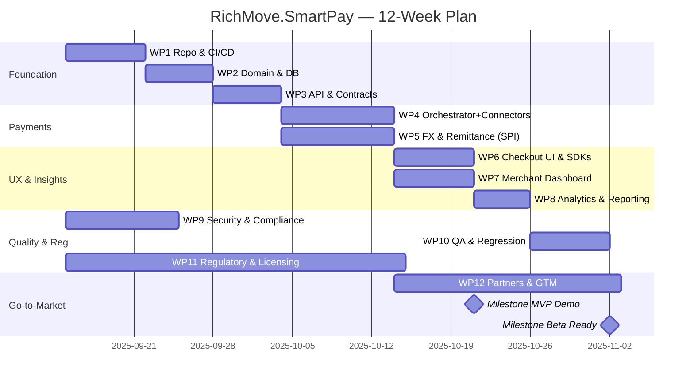

```mermaid
gantt
    title RichMove.SmartPay — 12-Week Plan
    dateFormat  YYYY-MM-DD
    section Foundation
    WP1 Repo & CI/CD           :a1, 2025-09-15, 7d
    WP2 Domain & DB            :a2, after a1, 6d
    WP3 API & Contracts        :a3, after a2, 6d
    section Payments
    WP4 Orchestrator+Connectors: b1, after a3, 10d
    WP5 FX & Remittance (SPI)  : b2, after a3, 10d
    section UX & Insights
    WP6 Checkout UI & SDKs     : c1, after b1, 7d
    WP7 Merchant Dashboard     : c2, after b2, 7d
    WP8 Analytics & Reporting  : c3, after c2, 5d
    section Quality & Reg
    WP9 Security & Compliance  : d1, 2025-09-15, 10d
    WP10 QA & Regression       : d2, after c3, 7d
    WP11 Regulatory & Licensing: d3, 2025-09-15, 30d
    section Go-to-Market
    WP12 Partners & GTM        : e1, after b1, 20d
    Milestone MVP Demo         : milestone, m1, after c1, 0d
    Milestone Beta Ready       : milestone, m2, after d2, 0d
```
